 
## 查看主页获取源码

### 一、作品包含

源码+数据库+设计文档万字+PPT+全套环境和工具资源+部署教程

### 二、项目技术

前端技术：Html、Css、Js、Vue、Element-ui

数据库：MySQL

后端技术：Java、Spring Boot、MyBatis

  

### 三、运行环境

开发工具：IDEA/eclipse

数据库：MySQL5.7

数据库管理工具：Navicat10以上版本

环境配置软件： JDK1.8+Maven3.6.3

前端Nodejs：14

### 四、项目介绍
项目编号：springbootA212

在高等教育领域，毕业设计作为学生学术生涯的重要环节，其选题过程对于培养学生的研究能力、实践技能和创新能力具有重要意义。然而，传统的选题方式往往存在效率低下、资源分配不均等问题。因此，毕业设计选题管理系统的研发与应用成为了一个研究热点，该系统旨在通过信息化手段优化选题流程，提升选题的科学性和合理性，从而为学生的学术成长和未来职业发展奠定坚实基础。本文即是在这样的背景下，探讨毕业设计选题管理系统的设计与实现，以期对现行教育管理模式进行改进和提升。

系统分为管理员、学生、教师
管理员的功能：系统首页、个人中心、学生管理、教师管理、毕设题目管理、毕设选题管理、毕设任务书管理、开题报告管理、中期检查管理、毕业论文管理、论文成绩管理、通知公告管理。
学生的功能：系统首页、个人中心、毕设题目管理、毕设选题管理、毕设任务书管理、开题报告管理、中期检查管理、毕业论文管理、论文成绩管理、通知公告管理。
教师的功能：系统首页、个人中心、毕设题目管理、毕设选题管理、毕设任务书管理、开题报告管理、中期检查管理、毕业论文管理、论文成绩管理、通知公告管理。

### 五、运行截图

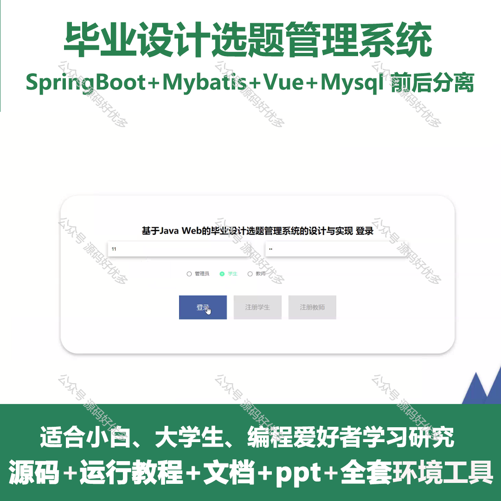
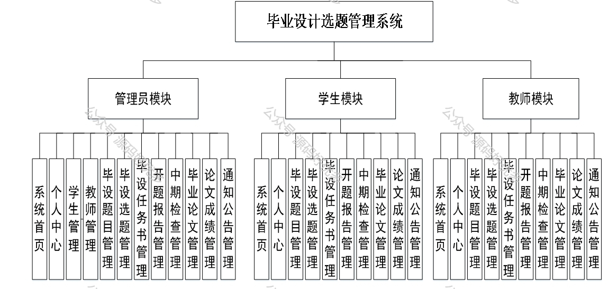
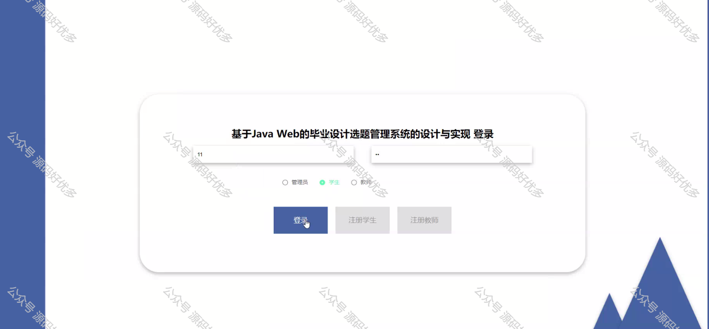
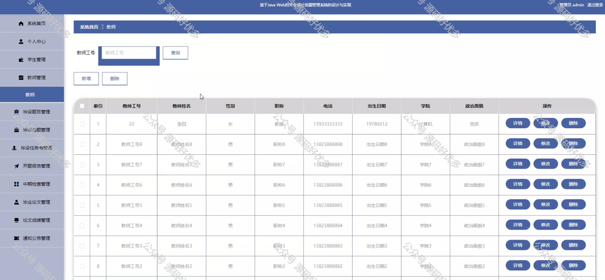
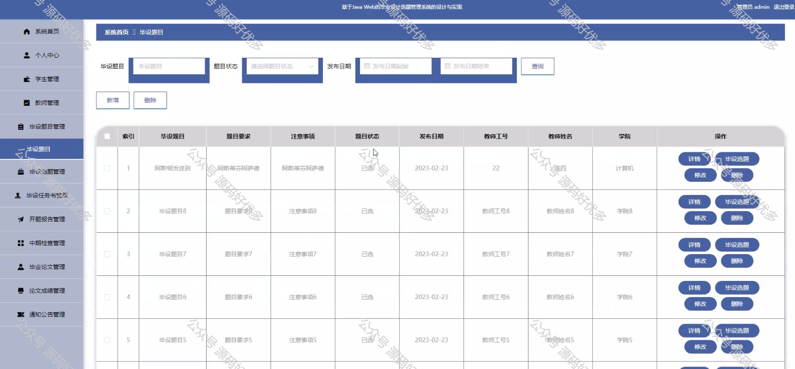
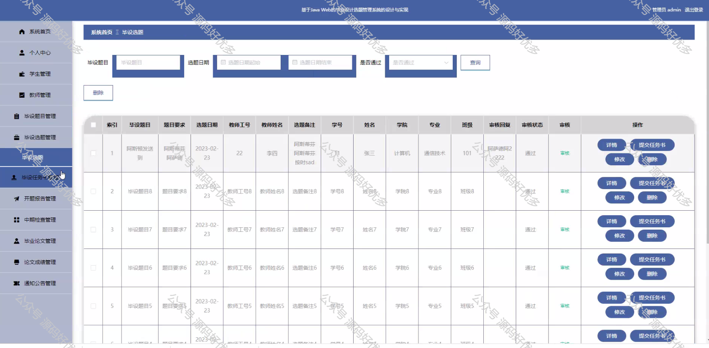
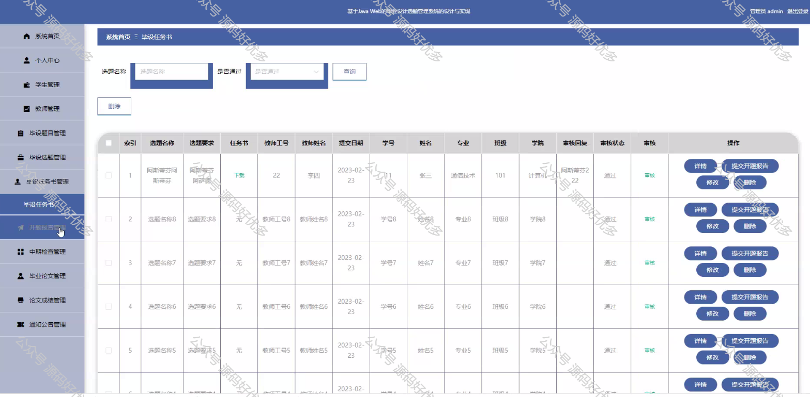
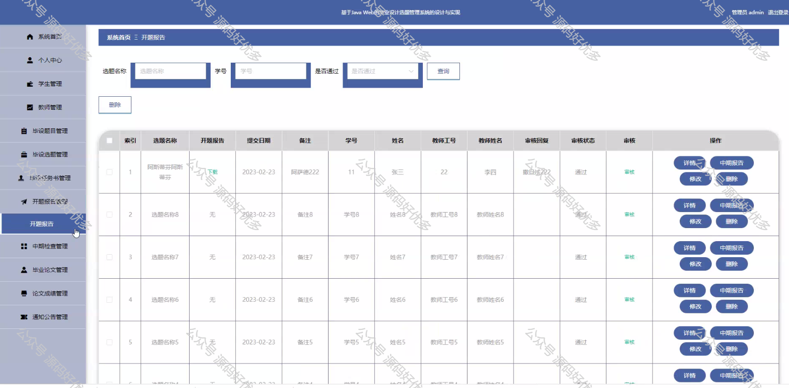
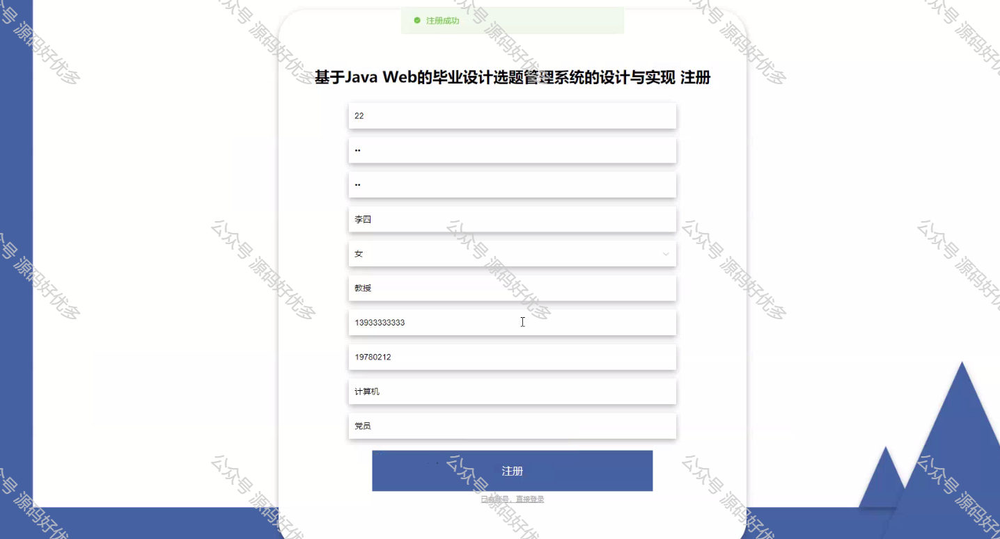
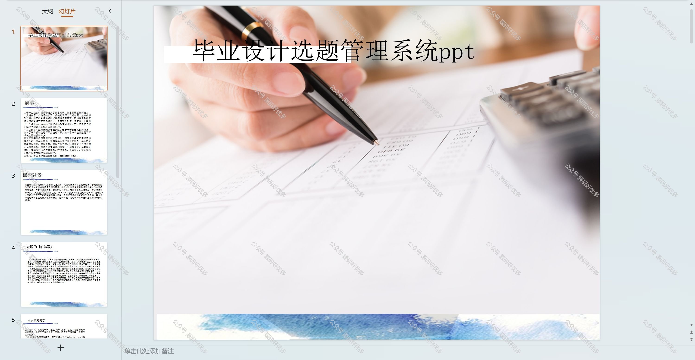
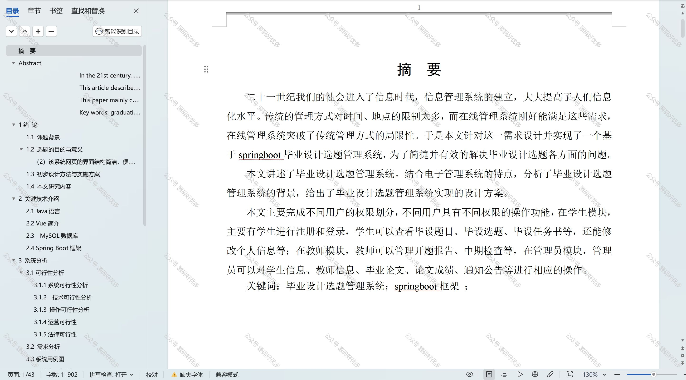

  

